<p align="center">
  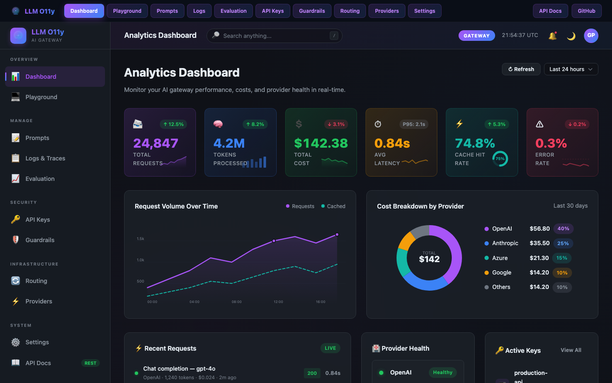
</p>

<h1 align="center">LLM O11y Platform</h1>

<p align="center">
  <strong>Open-Source Unified AI Gateway, Observability & Intelligence Platform</strong>
</p>

<p align="center">
  Production-grade AI gateway with intelligent routing, prompt management, guardrails,<br/>
  LLM-as-judge evaluation, virtual API keys, and full-stack observability<br/>
  powered by the Grafana LGTM Stack &amp; OpenTelemetry.
</p>

<p align="center">
  <a href="https://github.com/gpadidala/llm-o11y-platform/blob/main/LICENSE"></a>
  =3.11"/>
  
  
  
  
  
  
  <a href="https://github.com/gpadidala/llm-o11y-platform"></a>
  <a href="https://github.com/gpadidala/llm-o11y-platform/stargazers"></a>
  
  
</p>

<p align="center">
  <a href="#-quick-start">Quick Start</a> &bull;
  <a href="#%EF%B8%8F-architecture">Architecture</a> &bull;
  <a href="#-key-features">Features</a> &bull;
  <a href="#-screenshots">Screenshots</a> &bull;
  <a href="#-api-reference">API Reference</a> &bull;
  <a href="#-grafana-dashboards">Dashboards</a> &bull;
  <a href="#-deployment">Deployment</a>
</p>

---

## 🤔 Why This Platform?

Modern AI applications face a fragmented landscape:

- **Multiple LLM providers** — each with different APIs, pricing, rate limits, and failure modes
- **No unified control plane** — teams manage API keys, budgets, and routing manually
- **Cost blindspots** — token spend is invisible until the invoice arrives
- **No safety guardrails** — PII leaks, prompt injection, and toxic outputs go unchecked
- **Prompt chaos** — hard-coded prompts scattered across codebases with no versioning
- **Quality gaps** — no systematic way to evaluate LLM output quality at scale
- **Observability debt** — traces, metrics, and logs disconnected across tools

**This platform solves all of these** with a single self-hosted open-source solution.

---

## ✨ Key Features

### ⚡ AI Gateway Engine
- **Unified API** — OpenAI-compatible endpoint for 6 providers, 16+ models — zero code changes
- **Intelligent Routing** — 6 strategies: single, fallback, load-balance, cost-optimized, latency-optimized, canary
- **Response Caching** — Simple (SHA-256 exact match) + Semantic (trigram cosine similarity)
- **Rate Limiting** — Multi-dimensional token buckets: RPM, RPH, RPD, TPM, TPD, max concurrent
- **Circuit Breaker** — Per-provider 3-state machine (Closed/Open/Half-Open) with auto-recovery
- **Retry Logic** — Exponential backoff with full jitter for transient failures
- **Virtual Keys** — `sk-llmo-xxx` format keys with per-key budgets, provider/model permissions, team ownership

### 🧠 Prompt Management
- **Template Store** — Version-controlled prompt templates with `{{variable}}` interpolation
- **A/B Testing** — Create named variants for split-testing different prompt strategies
- **Live Testing** — Test templates against live models from the Prompt Studio UI
- **Auto-detection** — Variables are automatically parsed from template content

### 🛡️ Guardrails Engine
- **PII Detection** — 18 regex patterns: email, phone, SSN, credit cards, IP, API keys, addresses
- **PII Redaction** — `[EMAIL_REDACTED]`, `[SSN_REDACTED]`, etc.
- **Content Safety** — Pattern-based harmful content detection
- **Topic Restriction** — Block specific topics with word-boundary matching
- **Output Validation** — JSON schema validation, regex matching, length limits

### 📊 Evaluation Engine
- **LLM-as-Judge** — Automated quality scoring using a judge LLM
- **6 Criteria** — Relevance, Faithfulness, Helpfulness, Coherence, Toxicity, Custom
- **Batch Evaluation** — Run evaluations across entire datasets with concurrency control
- **Dataset Management** — Store and manage evaluation test sets

### 🔭 Full-Stack Observability
- **OpenTelemetry** — Traces + 8 custom metrics + structured logs via OTLP
- **19 Grafana Dashboards** — Per-provider, KPI, QoS, reliability, cost intelligence, model comparison, agent sessions
- **MCP Tracing** — Tool call ingestion, session tracking, cost attribution
- **GenAI Semantic Conventions** — Spans follow OTel GenAI standards

### 🎨 Next-Gen Web UI
- **10 Pages** — Dashboard, Playground, Prompt Studio, Request Explorer, API Keys, Evaluation, Guardrails, Routing, Providers, Settings
- **Dark Theme** — Glassmorphism effects, vibrant gradients, SVG sparkline charts
- **Real-time** — Live service health, auto-refreshing stats, streaming request feeds

---

## 🆚 Why Not Alternatives?

| Capability | **LLM O11y Platform** | Commercial Gateways | Basic Proxies | Manual Management |
|:-----------|:---------------------:|:-------------------:|:------------:|:-----------------:|
| Unified multi-provider API | ✅ | ✅ | ✅ | ❌ |
| 6 routing strategies | ✅ | Partial | ❌ | ❌ |
| Response caching (simple + semantic) | ✅ | Partial | ❌ | ❌ |
| Virtual keys with budgets | ✅ | ✅ | ❌ | ❌ |
| PII detection & redaction | ✅ | ✅ | ❌ | ❌ |
| Prompt versioning + A/B testing | ✅ | Partial | ❌ | ❌ |
| LLM-as-judge evaluation | ✅ | ❌ | ❌ | ❌ |
| Circuit breaker + rate limiting | ✅ | ✅ | ❌ | ❌ |
| 19 Grafana dashboards | ✅ | ❌ | ❌ | ❌ |
| Full OTel traces + metrics + logs | ✅ | Partial | ❌ | ❌ |
| MCP tool call tracing | ✅ | ❌ | ❌ | ❌ |
| Self-hosted / open-source | ✅ | ❌ | ✅ | ✅ |
| No vendor lock-in | ✅ | ❌ | ✅ | ✅ |

---

## 📸 Screenshots

### Analytics Dashboard
> Real-time stats with sparkline charts, cost breakdown donut, request feed, and provider health grid.


---

### AI Playground
> Test prompts across providers with parameter sliders. Compare Mode enables side-by-side model testing.

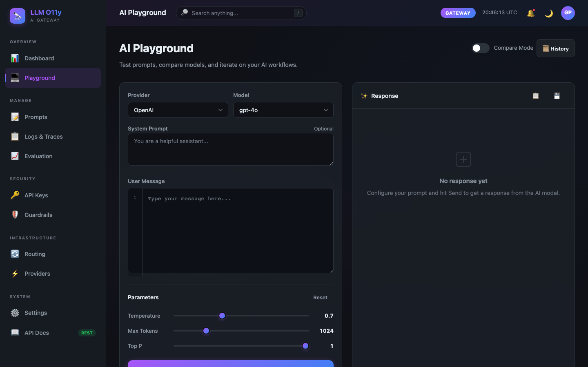

---

### Prompt Studio
> Version-controlled templates with `{{variable}}` detection, A/B variants, and live preview.

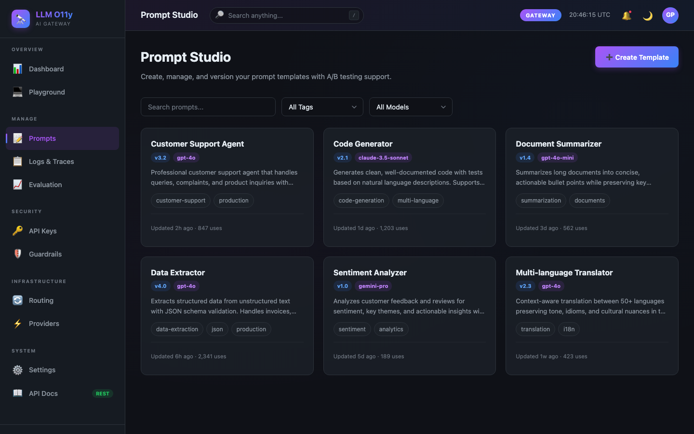

---

### Request Explorer
> Searchable request logs with provider, model, and status filters. Expandable rows show full request/response details.

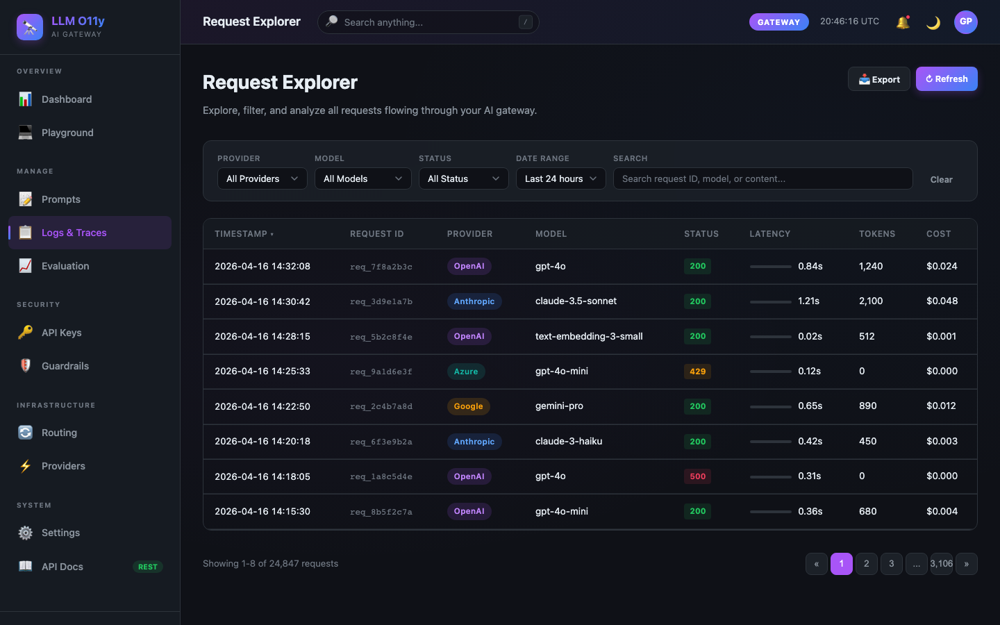

---

### Evaluation Dashboard
> Run LLM-as-judge evaluations with animated score bars. Batch eval across datasets.

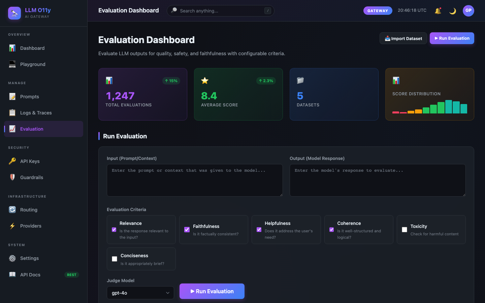

---

### Virtual Key Management
> Create `sk-llmo-xxx` keys with budget gauges, rate limit indicators, and team ownership.

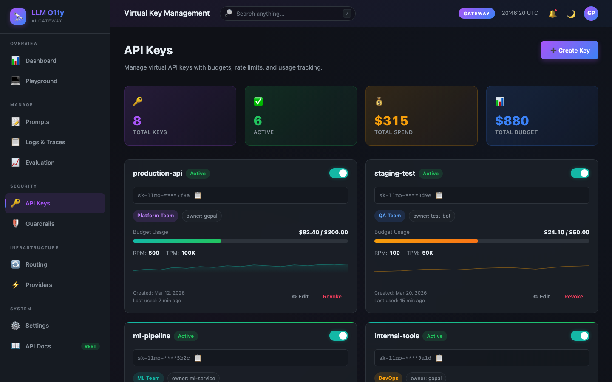

---

### Guardrails Configuration
> Toggle PII detection, content safety, topic restriction. Live test panel with highlighted PII matches.

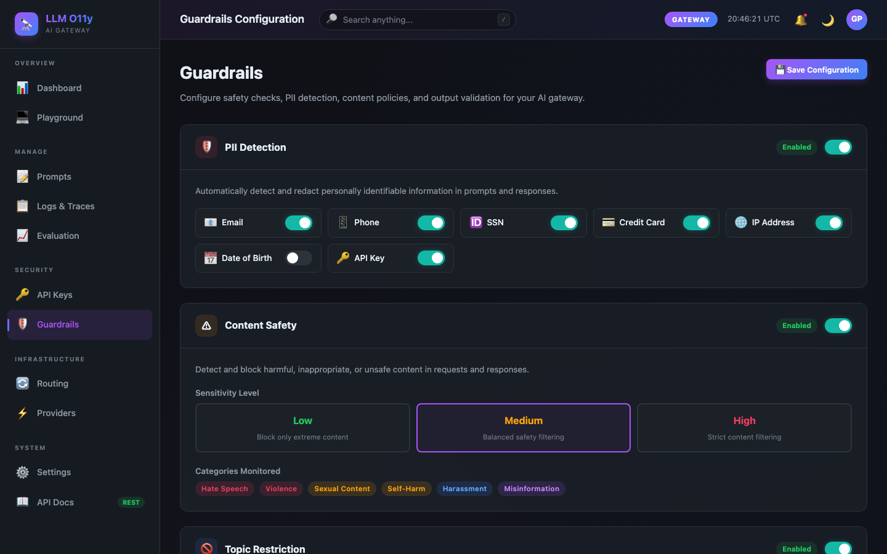

---

### Routing Configuration
> Visual strategy cards (Cost Optimized, Latency, Canary, etc.), dynamic targets, circuit breaker status.

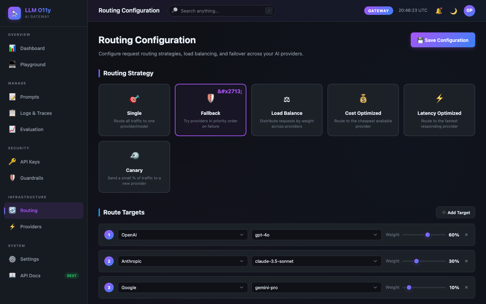

---

### Provider Status
> Per-provider health, latency, error rate, and configured model count.

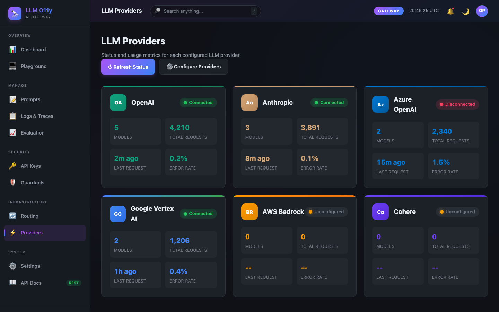

---

### Settings
> Configure API keys for all 6 providers, MCP server URLs, and gateway parameters.

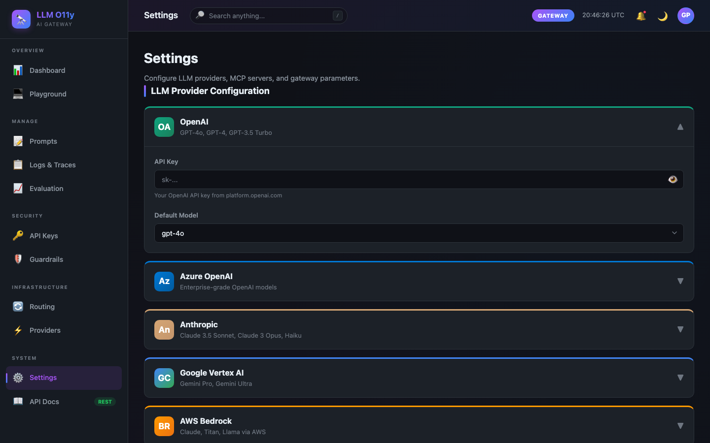

---

## 🏛️ Architecture

### Platform Layer Diagram

> 6-layer architecture: User, API, Gateway Engine, Intelligence, Provider, and Observability — each with dedicated components and technologies.

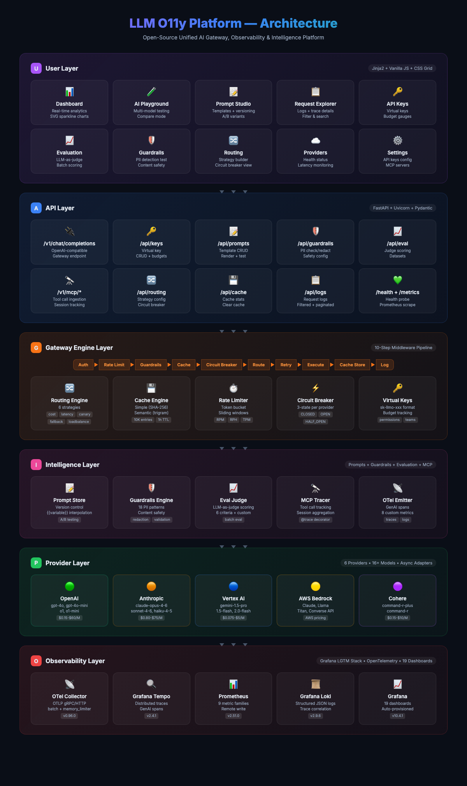

<details>
<summary><strong>Layer Details</strong></summary>

| Layer | Components | Technologies |
|-------|-----------|-------------|
| 🟣 **User** | Dashboard, Playground, Prompt Studio, Request Explorer, API Keys, Evaluation, Guardrails, Routing, Providers, Settings | Jinja2, Vanilla JS, CSS Grid |
| 🔵 **API** | /v1/chat/completions, /api/keys, /api/prompts, /api/guardrails, /api/eval, /v1/mcp/*, /api/routing, /api/cache, /api/logs, /health | FastAPI, Uvicorn, Pydantic |
| 🟠 **Gateway Engine** | Routing Engine (6 strategies), Cache Engine (simple + semantic), Rate Limiter (token bucket), Circuit Breaker (3-state), Virtual Keys (budgets + permissions) | 10-step middleware pipeline |
| 🩷 **Intelligence** | Prompt Store (versioning + A/B), Guardrails Engine (18 PII patterns), Eval Judge (6 criteria), MCP Tracer (sessions), OTel Emitter (spans + metrics) | LLM-as-judge, regex patterns |
| 🟢 **Provider** | OpenAI, Anthropic, Vertex AI, AWS Bedrock, Cohere, Azure OpenAI | openai, anthropic, vertexai, boto3, cohere SDKs |
| 🔴 **Observability** | OTel Collector, Grafana Tempo, Prometheus, Grafana Loki, Grafana (19 dashboards) | LGTM Stack, OpenTelemetry |

</details>

---

### End-to-End Request Flow

> Every LLM request traverses a 10-step gateway middleware pipeline — from auth to response with full telemetry emission.

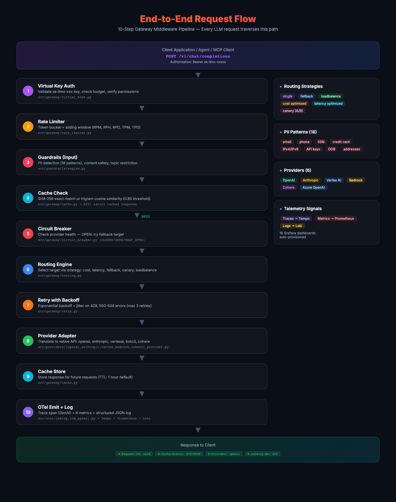

<details>
<summary><strong>Pipeline Steps</strong></summary>

| Step | Component | What Happens |
|------|-----------|-------------|
| 1 | **Virtual Key Auth** | Validate `sk-llmo-xxx` key, check budget, verify provider/model permissions |
| 2 | **Rate Limiter** | Token bucket + sliding window enforcement (RPM, RPH, RPD, TPM, TPD) |
| 3 | **Guardrails (Input)** | PII detection (18 patterns), content safety, topic restriction |
| 4 | **Cache Check** | SHA-256 exact match or trigram cosine similarity (0.85 threshold) |
| 5 | **Circuit Breaker** | Check provider health — OPEN state triggers fallback target selection |
| 6 | **Routing Engine** | Select target via strategy: cost, latency, fallback, canary, loadbalance |
| 7 | **Retry with Backoff** | Exponential backoff + jitter on 429/5xx errors (max 3 retries) |
| 8 | **Provider Adapter** | Translate to native API: openai, anthropic, vertexai, boto3, cohere |
| 9 | **Cache Store** | Store response for future requests (TTL: 1 hour default) |
| 10 | **OTel Emit + Log** | Trace span (GenAI semantic) + 8 metrics + structured JSON log |

</details>

---

### Observability Data Flow

```
  LLM O11y Gateway                   OpenTelemetry Collector
 ┌──────────────────┐               ┌─────────────────────────┐
 │  OTel SDK        │               │  Receivers: OTLP        │
 │  ├─ Traces       │──OTLP gRPC──▶│  Processors:            │
 │  ├─ Metrics (8)  │               │    memory_limiter       │
 │  └─ Logs (JSON)  │               │    batch (5s/512)       │
 └──────────────────┘               │    resource enrichment  │
                                     └───┬──────┬──────┬──────┘
                                         │      │      │
                              ┌──────────▼┐  ┌──▼───┐  ┌▼─────────┐
                              │  Tempo    │  │Prom  │  │  Loki    │
                              │  Traces   │  │Metrix│  │  Logs    │
                              └─────┬─────┘  └──┬───┘  └────┬─────┘
                                    └───────────┼────────────┘
                                           ┌────▼────┐
                                           │ Grafana │
                                           │ 19 dash │
                                           └─────────┘
```

---

## 🚀 Quick Start

### Option 1: Docker Compose (60 seconds)

```bash
git clone https://github.com/gpadidala/llm-o11y-platform.git
cd llm-o11y-platform
cp .env.example .env
docker compose up -d
```

Open http://localhost:8080 and you're running.

### Option 2: Manual Setup (~3 minutes)

```bash
# 1. Clone
git clone https://github.com/gpadidala/llm-o11y-platform.git
cd llm-o11y-platform

# 2. Create virtual environment
python3 -m venv .venv && source .venv/bin/activate

# 3. Install dependencies
pip install -r requirements.txt

# 4. Configure
cp .env.example .env
# Edit .env with your API keys

# 5. Run
uvicorn src.app:app --host 0.0.0.0 --port 8080
```

### Service URLs

| Service | URL | Credentials |
|---------|-----|-------------|
| **Platform UI** | http://localhost:8080 | — |
| **API Docs (Swagger)** | http://localhost:8080/docs | — |
| **Grafana** | http://localhost:3001 | admin / llm-o11y |
| **Prometheus** | http://localhost:9091 | — |
| **Tempo** | http://localhost:3202 | — |
| **Loki** | http://localhost:3100 | — |

### Verify Everything Works

```bash
# Health check
curl http://localhost:8080/health

# Check all subsystems
curl http://localhost:8080/api/status

# Test a chat completion (with your API key configured)
curl -X POST http://localhost:8080/v1/chat/completions \
  -H "Content-Type: application/json" \
  -d '{"model":"gpt-4o-mini","messages":[{"role":"user","content":"Hello!"}],"provider":"openai"}'

# Test PII redaction
curl -X POST http://localhost:8080/api/guardrails/redact \
  -H "Content-Type: application/json" \
  -d '{"text":"Email me at john@example.com, SSN 123-45-6789"}'

# Run smoke tests
bash scripts/test-gateway.sh
```

---

## 📡 API Reference

### Gateway API (OpenAI-Compatible)

Point your app's `base_url` at the gateway — zero code changes:

```python
from openai import OpenAI

client = OpenAI(
    base_url="http://localhost:8080/v1",
    api_key="sk-llmo-your-virtual-key",  # or provider key
)

response = client.chat.completions.create(
    model="gpt-4o",
    messages=[{"role": "user", "content": "Hello!"}],
    extra_body={
        "provider": "openai",
        "cache_mode": "simple",          # none, simple, semantic
        "routing_strategy": "cost",      # single, fallback, loadbalance, cost, latency, canary
        "user_id": "user-123",
        "tags": {"team": "ml-platform"},
    },
)
```

### Complete API Endpoint Reference

<details>
<summary><strong>Click to expand — 50+ endpoints</strong></summary>

#### Gateway Endpoints

| Method | Endpoint | Description |
|--------|----------|-------------|
| POST | `/v1/chat/completions` | OpenAI-compatible chat completions with full gateway pipeline |
| GET | `/v1/models` | List all supported models across providers |

#### Virtual Keys

| Method | Endpoint | Description |
|--------|----------|-------------|
| POST | `/api/keys` | Create virtual key with budget and permissions |
| GET | `/api/keys` | List all virtual keys |
| GET | `/api/keys/{id}` | Get key details |
| DELETE | `/api/keys/{id}` | Revoke a key |
| GET | `/api/keys/{id}/usage` | Get budget/usage stats |

#### Prompt Management

| Method | Endpoint | Description |
|--------|----------|-------------|
| POST | `/api/prompts` | Create prompt template |
| GET | `/api/prompts` | List templates (tag filter) |
| GET | `/api/prompts/{id}` | Get template |
| PUT | `/api/prompts/{id}` | Update template (new version) |
| DELETE | `/api/prompts/{id}` | Delete template |
| POST | `/api/prompts/{id}/render` | Render with variables |
| GET | `/api/prompts/{id}/versions` | Version history |
| POST | `/api/prompts/{id}/test` | Test against live model |

#### Guardrails

| Method | Endpoint | Description |
|--------|----------|-------------|
| POST | `/api/guardrails/check-input` | Check input messages |
| POST | `/api/guardrails/check-output` | Check output content |
| POST | `/api/guardrails/redact` | Redact PII from text |
| GET | `/api/guardrails/config` | Get guardrail config |
| PUT | `/api/guardrails/config` | Update guardrail config |

#### Evaluation

| Method | Endpoint | Description |
|--------|----------|-------------|
| POST | `/api/eval/run` | Single evaluation |
| POST | `/api/eval/batch` | Batch eval on dataset |
| GET | `/api/eval/results` | Get results (filtered) |
| GET | `/api/eval/stats` | Aggregate statistics |
| POST | `/api/eval/datasets` | Create dataset |
| GET | `/api/eval/datasets` | List datasets |
| GET | `/api/eval/datasets/{id}` | Get dataset |
| POST | `/api/eval/datasets/{id}/entries` | Add entries |
| DELETE | `/api/eval/datasets/{id}` | Delete dataset |

#### MCP Telemetry

| Method | Endpoint | Description |
|--------|----------|-------------|
| POST | `/v1/mcp/tool-call` | Ingest tool call record |
| POST | `/v1/mcp/session/start` | Start MCP session |
| POST | `/v1/mcp/session/end` | End session (aggregated span) |

#### Routing & Cache

| Method | Endpoint | Description |
|--------|----------|-------------|
| GET | `/api/routing/config` | Get routing strategy |
| PUT | `/api/routing/config` | Update routing config |
| GET | `/api/routing/stats` | Routing performance stats |
| GET | `/api/routing/circuit-breaker` | Circuit breaker states |
| GET | `/api/cache/stats` | Cache hit/miss/eviction stats |
| POST | `/api/cache/clear` | Clear all cached responses |

#### System

| Method | Endpoint | Description |
|--------|----------|-------------|
| GET | `/health` | Liveness probe |
| GET | `/metrics` | Prometheus scrape endpoint |
| GET | `/api/status` | Backend service health |
| GET | `/api/dashboard/stats` | Aggregated dashboard stats |
| GET | `/api/settings` | Get settings (secrets redacted) |
| POST | `/api/settings` | Save settings to .env |
| GET | `/api/logs` | Request logs (paginated) |
| GET | `/api/logs/{request_id}` | Specific request detail |

</details>

---

## 📊 Grafana Dashboards

19 pre-provisioned dashboards auto-loaded into the "LLM Observability" folder.

### Dashboard Catalog

| # | Dashboard | Panels | Description |
|---|-----------|--------|-------------|
| 1 | **Overview** | 15 | Request rate, error rate, latency percentiles, tokens, cost, MCP |
| 2 | **Cost & Token Analysis** | 6 | Cost deep-dive, token breakdown, top models |
| 3 | **Trace Explorer** | 4 | TraceQL search, trace detail, span distribution |
| 4 | **Advanced Traces** | 13 | Service map, correlated logs, error analysis |
| 5 | **OpenAI** | 13 | GPT-4o, GPT-4o-mini, o1, o1-mini metrics |
| 6 | **Anthropic** | 13 | Claude Opus, Sonnet, Haiku metrics |
| 7 | **Vertex AI (Gemini)** | 13 | Gemini 1.5 Pro/Flash, 2.0 Flash metrics |
| 8 | **AWS Bedrock** | 13 | Bedrock model metrics |
| 9 | **Cohere** | 13 | Command R+, Command R metrics |
| 10 | **KPI Scorecard** | 25 | Availability, performance, cost efficiency, cross-provider comparison |
| 11 | **Quality of Service** | 18 | SLA compliance, error budgets, capacity planning |
| 12 | **Reliability Engineering** | 20 | SLI/SLO, error budget burn rate, anomaly Z-scores, circuit breaker timeline |
| 13 | **Cost Intelligence** | 20 | Forecasting, budget tracking, anomaly detection, daily heatmap |
| 14 | **Model Comparison** | 20 | Performance matrix, cost matrix, value score, adoption trends |
| 15 | **Agent & MCP Sessions** | 20 | Tool analytics, session cost, server health |

### Telemetry Signals

| Signal | Prometheus Metric | Labels |
|--------|-------------------|--------|
| Request count | `llm_requests_total` | provider, model, status |
| Token usage | `llm_tokens_total` | provider, model, token_type |
| Cost (USD) | `llm_cost_usd_total` | provider, model |
| Request latency | `llm_request_duration_milliseconds` | provider, model |
| Time to first token | `llm_ttft_milliseconds` | provider, model |
| MCP tool calls | `mcp_tool_calls_total` | server_name, tool_name, status |
| MCP tool latency | `mcp_tool_duration_milliseconds` | server_name, tool_name |
| MCP session cost | `mcp_session_cost_usd_total` | session_id, agent_name |

---

## 🔐 Supported Providers & Models

| Provider | Models | Input / Output (per 1M tokens) |
|----------|--------|-------------------------------|
| **OpenAI** | gpt-4o | $2.50 / $10.00 |
| | gpt-4o-mini | $0.15 / $0.60 |
| | o1 | $15.00 / $60.00 |
| | o1-mini | $3.00 / $12.00 |
| **Anthropic** | claude-opus-4-6 | $15.00 / $75.00 |
| | claude-sonnet-4-6 | $3.00 / $15.00 |
| | claude-haiku-4-5 | $0.80 / $4.00 |
| **Google Vertex AI** | gemini-1.5-pro | $1.25 / $5.00 |
| | gemini-1.5-flash | $0.075 / $0.30 |
| | gemini-2.0-flash | $0.10 / $0.40 |
| **AWS Bedrock** | Claude, Llama, Titan | AWS pricing |
| **Azure OpenAI** | GPT-4o, GPT-4o-mini | Azure pricing |
| **Cohere** | command-r-plus | $2.50 / $10.00 |
| | command-r | $0.15 / $0.60 |

---

## ⚙️ Configuration

```bash
# .env — copy from .env.example

# ────── LLM Provider API Keys ──────
OPENAI_API_KEY=sk-your-openai-key          # Required for OpenAI models
ANTHROPIC_API_KEY=sk-ant-your-key          # Required for Claude models
COHERE_API_KEY=your-cohere-key             # Required for Cohere models

# ────── Azure OpenAI ──────
AZURE_OPENAI_API_KEY=your-azure-key        # Azure-hosted OpenAI
AZURE_OPENAI_ENDPOINT=https://xxx.openai.azure.com
AZURE_OPENAI_API_VERSION=2024-02-01

# ────── Google Vertex AI ──────
VERTEX_PROJECT_ID=your-gcp-project         # GCP project ID
VERTEX_LOCATION=us-central1                # Vertex AI region
GOOGLE_APPLICATION_CREDENTIALS=/path/to/sa.json

# ────── AWS Bedrock ──────
AWS_ACCESS_KEY_ID=your-access-key          # AWS IAM credentials
AWS_SECRET_ACCESS_KEY=your-secret-key
AWS_REGION=us-east-1

# ────── Gateway Settings ──────
GATEWAY_PORT=8080                          # Server port
LOG_LEVEL=info                             # debug, info, warning, error
```

---

## 📁 Project Structure

```
llm-o11y-platform/
│
├── src/                               # Application source (42 Python files, ~8,500 lines)
│   ├── app.py                         # FastAPI application (1,100+ lines)
│   ├── config.py                      # Pydantic Settings
│   │
│   ├── gateway/                       # 🟠 AI Gateway Engine
│   │   ├── router.py                  #   OpenAI-compatible API
│   │   ├── routing.py                 #   6 routing strategies
│   │   ├── cache.py                   #   Simple + semantic caching
│   │   ├── rate_limiter.py            #   Token bucket rate limiting
│   │   ├── circuit_breaker.py         #   Per-provider circuit breaker
│   │   ├── retry.py                   #   Exponential backoff
│   │   ├── virtual_keys.py            #   Virtual key management
│   │   └── middleware.py              #   10-step gateway pipeline
│   │
│   ├── providers/                     # 🟢 LLM Provider Adapters
│   │   ├── base.py                    #   ABC + MODEL_PRICING (16 models)
│   │   ├── openai_provider.py         #   OpenAI adapter
│   │   ├── anthropic_provider.py      #   Anthropic adapter
│   │   ├── vertex_provider.py         #   Google Vertex AI adapter
│   │   ├── bedrock_provider.py        #   AWS Bedrock adapter
│   │   └── cohere_provider.py         #   Cohere adapter
│   │
│   ├── prompts/                       # 🩷 Prompt Management
│   │   ├── templates.py              #   Versioned template store
│   │   └── router.py                 #   CRUD + render + test API
│   │
│   ├── guardrails/                    # 🛡️ Guardrails Engine
│   │   ├── engine.py                  #   PII + safety + validation pipeline
│   │   ├── pii.py                     #   18 PII detection patterns
│   │   └── router.py                  #   Guardrails API
│   │
│   ├── eval/                          # 📊 Evaluation Engine
│   │   ├── judge.py                   #   LLM-as-judge (6 criteria)
│   │   ├── datasets.py               #   Dataset management
│   │   └── router.py                  #   Evaluation API
│   │
│   ├── mcp_tracer/                    # 🔭 MCP Observability
│   │   ├── router.py                  #   Tool call + session API
│   │   └── interceptor.py            #   @trace_mcp_tool decorator
│   │
│   ├── otel/                          # 📡 OpenTelemetry
│   │   ├── setup.py                   #   Bootstrap (traces + 8 metrics)
│   │   ├── llm_spans.py              #   GenAI semantic convention spans
│   │   └── mcp_spans.py              #   MCP spans + session tracker
│   │
│   ├── models/                        # 📦 Pydantic Data Models
│   │   ├── telemetry.py               #   Request/Response/Provider
│   │   ├── keys.py                    #   Virtual key models
│   │   ├── prompts.py                 #   Prompt template models
│   │   └── eval.py                    #   Evaluation models
│   │
│   ├── templates/                     # 🎨 Jinja2 HTML Templates (11 pages)
│   └── static/                        # 📁 Frontend JavaScript
│
├── grafana/
│   ├── dashboards/                    # 19 Grafana dashboard JSONs
│   └── provisioning/                  # Auto-provisioning configs
│
├── k8s/base/                          # Kubernetes manifests
├── docs/screenshots/                  # UI screenshots
├── scripts/                           # Smoke tests + AKS deploy
│
├── docker-compose.yaml                # 6-service local stack
├── Dockerfile                         # Multi-stage Python 3.11
├── otel-collector-config.yaml         # OTel Collector pipeline
├── tempo-config.yaml                  # Grafana Tempo config
├── loki-config.yaml                   # Grafana Loki config
├── prometheus.yaml                    # Prometheus scrape config
├── pyproject.toml                     # Python project metadata
├── requirements.txt                   # Pinned dependencies
└── .env.example                       # Environment template
```

---

## 🚢 Deployment

### Docker Compose (Local / Dev)

```bash
docker compose up -d          # Start all 6 services
docker compose logs -f        # Follow logs
docker compose down           # Stop everything
```

### Kubernetes (AKS)

```bash
export RESOURCE_GROUP=llm-o11y-rg
export CLUSTER_NAME=llm-o11y-aks
export ACR_NAME=llmo11yacr

bash scripts/deploy-aks.sh
```

### Bare Metal

```bash
pip install -r requirements.txt
OTEL_EXPORTER_OTLP_ENDPOINT=http://your-collector:4317 \
  uvicorn src.app:app --host 0.0.0.0 --port 8080
```

---

## 🧱 Tech Stack

<p align="center">
  
  
  
  
  
  
  
  
  
  
  
</p>

| Layer | Technology |
|-------|-----------|
| **Gateway** | Python 3.11, FastAPI, Uvicorn, Pydantic, structlog |
| **LLM SDKs** | openai, anthropic, google-cloud-aiplatform, boto3, cohere |
| **Telemetry** | OpenTelemetry SDK, OTLP gRPC exporters |
| **Collector** | OpenTelemetry Collector Contrib 0.96.0 |
| **Traces** | Grafana Tempo 2.4.1 |
| **Metrics** | Prometheus 2.51.0 |
| **Logs** | Grafana Loki 2.9.6 |
| **Dashboards** | Grafana 10.4.1 (19 dashboards) |
| **Frontend** | Jinja2, vanilla JavaScript, CSS Grid, SVG charts |
| **Containers** | Docker, Docker Compose |
| **Orchestration** | Kubernetes (AKS manifests) |

---

## 🗺️ Roadmap

- **V1.0** — Unified gateway, 6 providers, OTel instrumentation, 19 dashboards, web UI, Docker Compose
- **V1.1** — Intelligent routing (6 strategies), response caching, rate limiting, circuit breaker, virtual keys
- **V1.2** — Prompt management, guardrails engine (PII/safety), LLM-as-judge evaluation, request logging
- **V2.0** — Streaming support, WebSocket real-time updates, Helm chart, GitHub Actions CI/CD
- **V2.1** — Agent framework integration, RAG pipeline tracing, embedding model support
- **V2.2** — Multi-tenant teams, RBAC, SSO/SAML, audit logs
- **V2.3** — Semantic caching with vector embeddings, custom guardrail plugins, webhook alerts

---

## 🤝 Contributing

1. Fork the repository
2. Create a feature branch (`git checkout -b feature/amazing-feature`)
3. Commit changes (`git commit -m 'Add amazing feature'`)
4. Push to branch (`git push origin feature/amazing-feature`)
5. Open a Pull Request

See [CONTRIBUTING.md](CONTRIBUTING.md) for detailed guidelines.

---

## 📜 License

This project is licensed under the MIT License — see the [LICENSE](LICENSE) file for details.

---

## 👤 Author

**Gopal Padidala**

[](https://github.com/gpadidala)
[](mailto:gopalpadidala@gmail.com)

---

<p align="center">
  <strong>Built with FastAPI, OpenTelemetry, and the Grafana LGTM Stack</strong>
  <br/>
  <sub>42 Python files &bull; 11 HTML pages &bull; 19 Grafana dashboards &bull; ~28,000 lines of code</sub>
</p>
